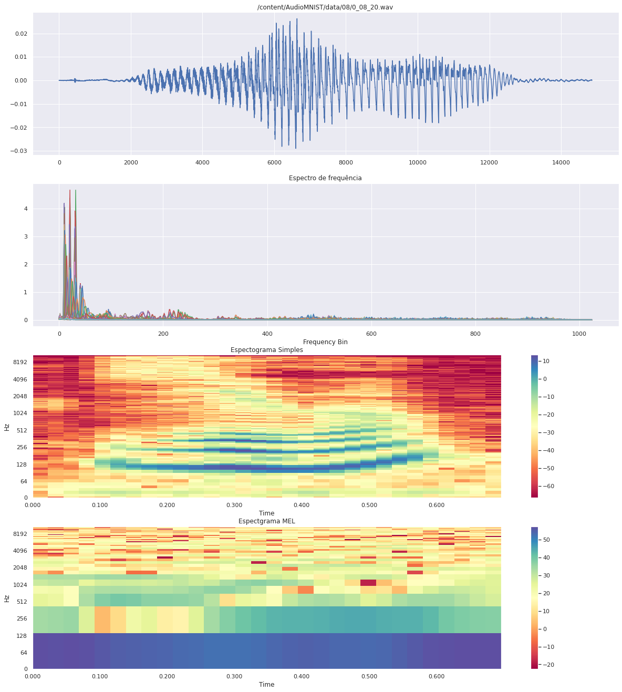
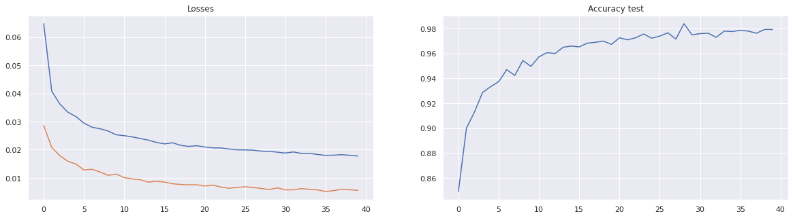
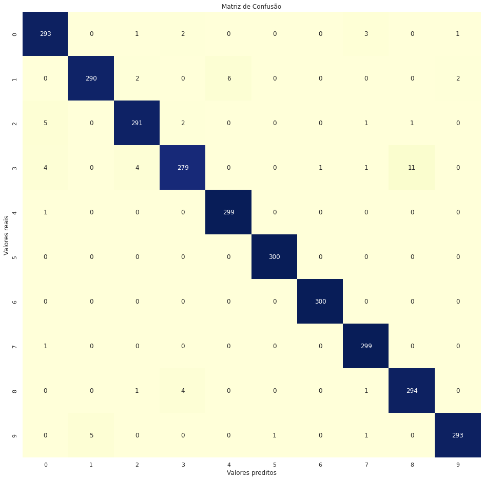

# Classificacao de Audio

- Este repositório foi desenvolvido para aprendizado/treinamento de criação de uma rede neural bem simples para classificação de áudios. O treinamento foi realizado utilizando [Pytorch](https://pytorch.org/) e a pacote python [Librosa](https://librosa.org/doc/latest/index.html) que é um pacote python bem famoso para obter informações de áudios.

- O dataset escolhido está neste repositório: [https://github.com/soerenab/AudioMNIST.git](https://github.com/soerenab/AudioMNIST.git) e sua respectiva referência:  
```
@ARTICLE{becker2018interpreting,
  author    = {Becker, S\"oren and Ackermann, Marcel and Lapuschkin, Sebastian and M\"uller, Klaus-Robert and Samek, Wojciech},
  title     = {Interpreting and Explaining Deep Neural Networks for Classification of Audio Signals},
  journal   = {CoRR},
  volume    = {abs/1807.03418},
  year      = {2018},
  archivePrefix = {arXiv},
  eprint    = {1807.03418},
}
```

# Análise dos dados

- Antes de começar a criar modelo etc, fazemos algumas análises dos áudios, através do pacote Librosa:  



- Onde a primeira figura representa o sinal em função do tempo; 
- A segunda figura representa os sinais em função da frequênia; 
- Terceira figura representa o Espectograma do áudio;
- Quarta figura representa o Espectograma na escala MEL, cuja proposta é representar a interpretação dos tons na forma como humanos percebem, que é aproximadamente na forma logarítimica, ao invés de linear.

# Resultados

- Assim, extraímos essas características, transofmamos em tensores, criamos o dataset e DataLoader, criamos o modelo, função perda, otimizador e funções de validação.  
- Depois do treinamento, vemos a performance do modelo:  






# Conclusões

- Interessante perceber que o modelo é bem simples e muito "leve". 
- Obteve uma performance muito boa, ~ 98%. Isso se deve ao dataset estar bem balanceado e os dados estarem bem uniformes e bem anotados.  
